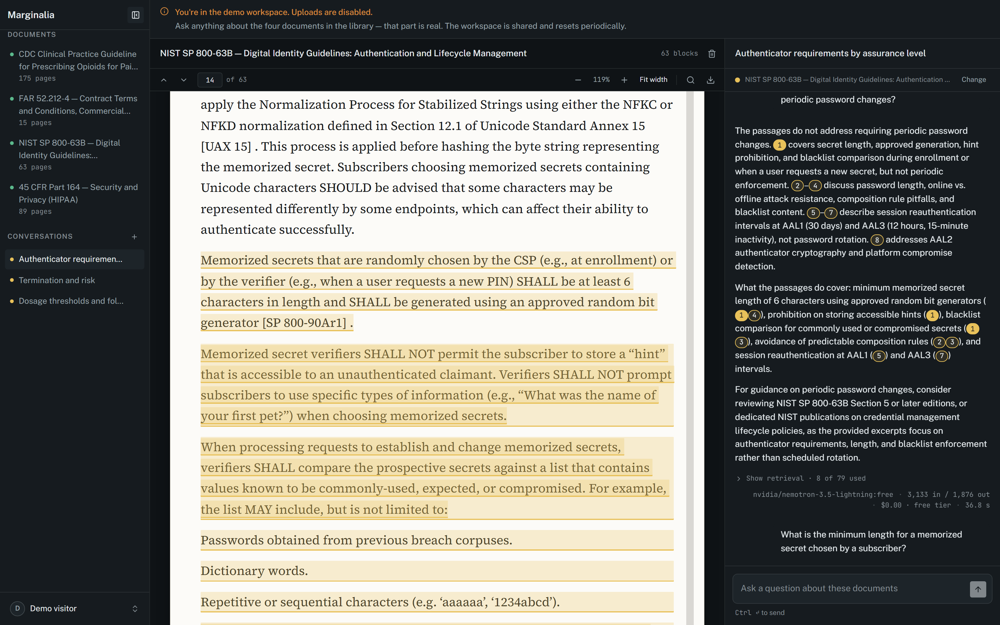
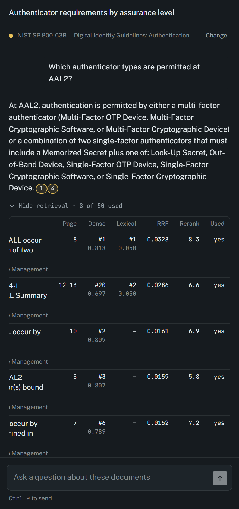
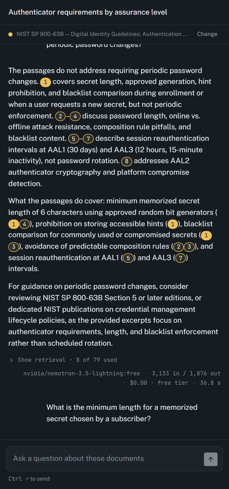
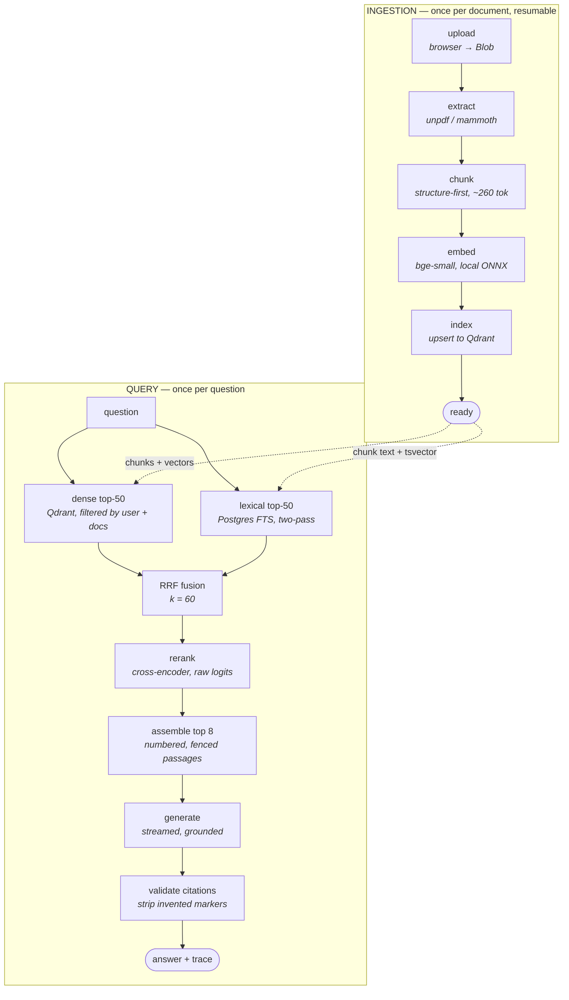

# Marginalia

Ask questions about long documents and get answers where every claim carries a citation that opens the exact passage it came from.

**[Open the live demo](https://marginalia-lake-six.vercel.app/demo)** — no sign-up. Four public-domain documents are already ingested and answered.

[](https://nextjs.org)
[](https://react.dev)
[](https://www.typescriptlang.org)
[](https://neon.tech)
[](https://qdrant.tech)
[](https://huggingface.co/docs/transformers.js)
[](LICENSE)

---



A question was asked on the right. The answer carries numbered markers. Clicking one scrolled the document to the passage and inked it — the highlight and the underline are the citation. The thin strip down the right edge of the paper is the Evidence Rail: one tick per passage this conversation has cited, positioned by where it sits in the whole document rather than in the visible part.

Two more, because they are the parts that are usually hidden:

| Retrieval trace | An honest refusal |
| --- | --- |
|  |  |
| Every candidate, both channels, the fused score, and what actually made it into the model's context. Note row three: the lexical channel found nothing (`—`) and dense carried it. | The passages did not answer the question, so the answer says so, says what they *do* cover, and points somewhere else. This is a correct response, and it is in the eval set. |

---

## What it does

- **Upload a long document** — a contract, a regulation, a clinical guideline, a standard. PDF, DOCX, TXT or Markdown, up to 25 MB.
- **Ask questions in plain language.** Answers come only from passages retrieved out of your documents, never from the model's own memory.
- **Every factual claim carries a `[n]` marker.** Click it and the document scrolls to that passage and highlights it. The marker is a link to evidence, not a footnote.
- **When the documents don't answer, it says so** — and says what they do cover, and what to search for instead. It does not produce a plausible near-miss.
- **See exactly how the answer was found.** A "Show retrieval" row under every answer opens the full ranking: both search channels, their scores, the fusion, the rerank, and which passages the model actually saw.

---

## Architecture



Both channels run concurrently. Every dense search carries a payload filter on `user_id` **and** the selected `document_ids` — that filter lives inside a single `search()` helper and no call site may build its own query, because a vector search without it silently returns other users' documents.

### Where each thing lives, and why

| Store | Holds | Why there |
| --- | --- | --- |
| **Postgres** (Neon) | documents, pages, chunk **text**, the lexical `tsvector`, conversations, messages, citations, retrieval traces, usage, job state | It is the source of truth and the only store with transactions. Every durable limit is enforced *inside the transaction of the write it constrains*, under a per-user advisory lock — that is not possible across two systems. Full-text search lives here too, so the lexical channel needs no third service. |
| **Qdrant** | one vector per chunk, plus a five-field payload: `user_id`, `document_id`, `chunk_id`, `page_from`, `page_to` | Filtered ANN search over a growing collection is what a vector database is for, with payload indexes on `user_id` and `document_id`. The payload is deliberately tiny: it carries what a *filter* needs, not what a *reader* needs. Chunk text stays in Postgres so there is one copy of it. |
| **Vercel Blob** | the original uploaded file | Function request bodies are capped at 4.5 MB on Vercel, so bytes go browser → Blob directly with a short-lived token. The store is **private**; the file is served back through an app route that re-checks ownership per request and sends it as an attachment. |

---

## Retrieval, in detail

**Chunking is structure-first, ~260 tokens.** Split on headings, then paragraphs, then sentences; never mid-sentence; ceiling 320; anything under 60 tokens merges backwards. The budget is not a preference — `bge-small-en-v1.5` is BERT WordPiece with a hard 512-token limit that Transformers.js **truncates past silently**. Chunk budgets are counted in cl100k tokens, and the ratio between the two is not a constant: clause-heavy legal prose runs ~1.19 WordPiece per cl100k token, dense numeric and citation prose up to 1.44, because WordPiece shatters bracketed references, section numbers and dosage units. A 300/380/70 budget measured a comfortable 462/512 against synthetic legal text and then produced **thirteen over-limit chunks on the real corpus, worst at 556**. 260/320/60 measures 459/512 worst-case with zero truncations.

**The context header.** Before embedding, each chunk is prefixed with `<document title> — <section path>`. The *augmented* text is embedded; the *original* is stored and displayed. "Thirty days notice" means something different under *Termination for convenience* than under *Force majeure*, and the chunk itself often doesn't say which it's under.

**Why hybrid, concretely.** `websearch_to_tsquery` ANDs every term, so the lexical channel needs a second pass — strict first, then the same parsed query with top-level ` & ` rewritten to ` | ` if strict found nothing (skipped when the query contains a negation, since `a | !b` matches everything lacking `b`). And the channels genuinely disagree. Measured on this corpus:

> **"What does 164.312(a)(2)(iii) require?"** — the lexical channel returns 2 hits on the strict pass. **Neither appears anywhere in the dense channel's top 50.**

An embedding of a paragraph designator is an embedding of punctuation and digits; it has almost nothing to be similar to. Exact identifiers — clause numbers, part numbers, statutory cites — are precisely what people ask contracts and regulations about, and dense retrieval alone is close to blind to them.

**Fusion is Reciprocal Rank Fusion**, over ranks rather than scores, because a cosine similarity and a `ts_rank` are not on a comparable scale:

$$\text{RRF}(d) = \sum_{c \in \text{channels}} \frac{w_c}{k + \text{rank}_c(d)}, \qquad k = 60$$

A passage absent from a channel contributes nothing rather than zero — rank is `null`, not `0`, all the way through to the trace.

**What reranking bought.** A cross-encoder (`ms-marco-MiniLM-L-6-v2`) re-scores the fused top candidates, reading raw logits rather than a softmax — the model has a single output logit, so a softmax over one value is `1.0` and every passage ties. Measured over the 38 answerable questions, same corpus, same budget, everything else fixed:

| | rerank off | rerank on |
| --- | --- | --- |
| recall@5 | 81.6% | **86.8%** |
| recall@10 | 92.1% | **94.7%** |
| MRR | 0.669 | **0.739** |
| retrieval p50 | 1.83 s | 3.78 s |

Roughly two seconds for five points of recall@5 and 0.07 MRR. Worth it here, because the failures it fixes are the expensive kind — questions wrongly declined because the answering passage sat outside the top 8. It stays switchable off, and the harness checks that path on every run.

---

## Evaluation

`npm run eval` runs a fixed question set through the shipping pipeline and scores it. **46 hand-written questions: 38 answerable, 8 unanswerable** (two of the eight carry prompt-injection payloads). Answerable questions declare the block that contains the answer and a few verbatim phrases a supporting passage must contain.

**Retrieval — re-measured on the current chunk budget:**

| Metric | rerank off | rerank on | What it measures |
| --- | --- | --- | --- |
| recall@5 | 81.6% (31/38) | **86.8%** (33/38) | Did a passage on an expected block reach the top 5? |
| recall@10 | 92.1% (35/38) | **94.7%** (36/38) | …the top 10? |
| MRR | 0.669 | **0.739** | How high, on average. 1.0 = always first. |
| retrieval p50 | 1.83 s | 3.78 s | Local embedding + both channels + fusion (+ rerank). |

**Generation** — from an earlier run, and the provenance matters:

| Metric | Value | Note |
| --- | --- | --- |
| Citation validity | **100%** (85 markers, 0 invalid) | Every marker mapped to a retrieved passage. Anything below 100% is a bug, not a score. |
| Citation support | 57.6% | Of cited passages, how many contained an expected phrase. The weakest number here and the most useful one. |
| Refusal accuracy | **100%** (6/6 unanswerable) | Declined every question the corpus does not answer. |
| False refusals | **3** of 37 answerable | The other half of the ledger. A system that refuses everything scores 100% above. |

> **Read those generation numbers with their caveat.** They come from a run recorded under the *previous* 300/380/70 chunk budget, a 44-question set, and `z-ai/glm-5.2:free` — not the model configured today. Eval result files are measurements and are never rewritten, so they say what happened on the day they were recorded. Reproducing them under the current configuration means a fresh generation run, which costs 46 requests against a shared 50/day free quota. The retrieval table above *was* re-measured; the generation table has not been.

**This is a starting point, not a benchmark, and the distinction is the point.** 46 questions written by the person who built the system, over 3 of the 4 corpus documents (NIST SP 800-63B is ingested and demoed but has no eval questions yet). It is large enough to catch a regression and far too small to publish a leaderboard number. Its real value is the unanswerable questions: a retrieval system that always returns its best eight passages will always produce something plausible, and the only way to find out whether it knows the difference between *here is the answer* and *here is the nearest thing I have* is to ask it things with no answer and watch.

`npm run eval -- --compare A B` diffs two runs and prints which questions moved.

---

## Technical decisions

| Decision | Why | Tradeoff accepted |
| --- | --- | --- |
| **Qdrant, not pgvector** | Payload-filtered ANN over a growing collection, with indexes on `user_id` and `document_id`, is what it is built for. Keeping vectors out of Postgres also keeps the row budget for rows. | A second service, a second failure mode, and no transaction spanning both. Mitigated by making Postgres the source of truth: a stranded vector is harmless, a stranded row is not. |
| **Local Transformers.js embeddings, not a hosted embedding API** | Zero cost, no vendor key, no per-token metering, no rate limit, and no third party seeing document text. Ingestion of a 300-page PDF costs CPU, not money. | Cold-start latency (~15 s on a fresh serverless instance to fetch 34 MB of weights) and a few MTEB points versus a large hosted embedder. Also a real deployment constraint — the ONNX runtime's shared library has to be traced into the function explicitly. |
| **bge-small-en-v1.5 (384d), not bge-base (768d)** | Half the vector size, roughly a third of the memory, and it fits in a serverless function alongside a reranker. On this corpus the ranking gap did not justify doubling the index. | A measurable but small retrieval-quality gap. Changing it is a new collection and a full re-ingest, never a config edit — the dimension is part of the embedding space. |
| **Hybrid, not dense-only** | Exact identifiers are what people ask legal and regulatory documents about, and dense retrieval is nearly blind to them — measured above. | Two queries per question and a fusion step. Also a two-pass lexical query, because `websearch_to_tsquery` ANDs terms and would otherwise return nothing for most natural questions. |
| **~260-token chunks (ceiling 320)** | The embedding model truncates past 512 WordPiece tokens **silently**. The budget is set from a measured worst case on the real corpus, not from an estimate. | Smaller chunks mean more of them and slightly lower recall@5 than the larger budget scored — a real cost, paid to remove a failure that produces wrong answers with no error. |
| **OpenRouter `:free` models** | Free and card-less. Every configured slug must end in `:free`, checked at boot — a paid slug bills on first call and the only signal is an invoice. | ~20 requests/minute and **50/day** on an account with no credits, and free models get delisted without notice. Hence an ordered fallback pool, failover on 404/408/429/5xx, and the model that actually served each answer recorded on the message row. |
| **Client-direct uploads to Blob** | Vercel caps function request bodies at 4.5 MB, and base64 inflation makes the real ceiling nearer 3 MB. A 20 MB contract is rejected by the platform before any application code runs. | The client picks its own upload path, so the server re-derives what the path is allowed to be, and re-reads the stored object's real type and size before a row exists. |
| **Ingestion as a state machine** | `documents.status` names the stage that is pending, so resuming is "run the stage the status names". Each stage is idempotent and independently re-runnable, and failures surface with a Retry that resumes from where it died. | More moving parts than a single `processDocument()`. It buys a pipeline that survives a function timeout mid-document, and an orchestrator that a real queue could replace without touching a stage. |
| **Text-offset citations, not stored bounding boxes** | Chunks record character offsets into the document's concatenated text; the viewer re-finds the passage in the rendered page. This works identically for PDF, DOCX, TXT and Markdown, and survives re-rendering at any zoom. | Highlighting is a text match, so a passage broken across a line in a way extraction normalised can go unpainted — a degradation, not a wrong answer. Bounding boxes would be pixel-exact and would only work for PDFs. |

---

## Known limitations

- **No OCR.** A scanned PDF with no text layer is refused with a message saying so, rather than being indexed as an empty document that answers every question with "not found". The seam for an OCR provider is in `extract.ts`.
- **DOCX, TXT and Markdown have no real pages.** Word's own page numbers depend on the printer driver and installed fonts. Extraction synthesizes ~3,000-character blocks and the interface calls them "blocks", not "pages" — a citation must not claim a precision the source does not have.
- **Prompt injection is mitigated, not solved.** Retrieved passages are fenced between explicit markers, labelled as data, and the fence is neutralised in passage text so a document cannot close its own quotation. A delimiter plus an instruction is a strong prior, not a guarantee. What bounds the damage is architectural: the model has no tools, no network access and no write path, its output is never rendered as HTML, and its markers are validated server-side. Two eval questions carry injection payloads and assert an absence.
- **The eval set is small and self-authored** — 46 questions over 3 of the 4 corpus documents. See the caveat above.
- **Free-tier cold starts are real.** Neon scales to zero after ~5 minutes idle (~500 ms on the first query), and a cold serverless instance downloads 34 MB of model weights. Measured end-to-end on the live deployment: **42 s cold, 27–29 s warm**, most of the warm time being the free model generating rather than retrieval.
- **Local inference costs latency on ingestion** and gives up a few points of embedding quality against a large hosted model. That is a deliberate trade for zero cost and no vendor key, and the `EmbeddingProvider` interface has a second implementation if it stops being the right one.
- **The free model roster changes.** OpenRouter delists `:free` variants without notice, so the model that answers may differ between runs — which is why the model that actually served each answer is recorded on the message row and shown under it.
- **Rate limiting is in-memory**, so N warm instances enforce a limit up to N times looser. The durable limits are counted in Postgres inside the transaction they constrain, so this costs a few extra requests and never an extra document or message.

---

## Running locally

**Prerequisites** — Node 20+, a Postgres database (Neon's free tier is fine), a Qdrant instance (Qdrant Cloud's free tier is fine), an OpenRouter API key with **no credits purchased**, and a Vercel Blob store.

```bash
git clone https://github.com/HajibagheriLabs/Marginalia.git
cd Marginalia
npm install
cp .env.example .env.local
```

Fill in `.env.local`. Every variable is documented there; the ones with no default are `DATABASE_URL`, `BETTER_AUTH_SECRET`, `BETTER_AUTH_URL`, `NEXT_PUBLIC_APP_URL`, `BLOB_READ_WRITE_TOKEN`, `QDRANT_URL`, `QDRANT_API_KEY`, `OPENROUTER_API_KEY` and `INGEST_SECRET`. Generate the two secrets with:

```bash
openssl rand -base64 32
```

Create the schema, then seed the demo corpus:

```bash
npm run db:migrate
npm run db:seed
```

`db:seed` puts four public-domain documents through the real chunk → embed → index stages and produces the demo conversations by calling the shipping answer engine. The first run downloads the embedding model (~34 MB) and takes a few minutes.

```bash
npm run dev
```

Then <http://localhost:3000>. `/demo` signs you in as the seeded demo account.

**Evaluation:**

```bash
npm run eval                          # full run, including generation
npm run eval -- --retrieval-only      # retrieval metrics only, no model calls
npm run eval -- --no-rerank           # with reranking off
npm run eval -- --compare A B         # diff two result files
```

**Tests** — four guarantees, each with its own command, so a red build names what broke:

```bash
npm run test:unit    # chunking, offsets, markers, RRF, prompt fencing, headers
npm run test:p1      # cross-user isolation
npm run test:p2      # citation faithfulness
npm run test:p3      # ingestion idempotency
npm run test:p4      # retrieval correctness
npm run test:e2e     # browser: sign in, ask, cite, click, scroll
npm test             # everything
```

The integration suites use real Postgres, real Qdrant and the real embedding model. They **skip** when credentials are absent, so a fresh clone works, and **fail** in CI when they are absent, because a skipped suite reports green.

Deployment is a separate document: **[DEPLOY.md](DEPLOY.md)**.

---

## What I'd do next

1. **OCR for scanned PDFs.** The most common real-world upload this refuses. The provider seam already exists and `ocrUsed` is already on the extraction result, because a citation into recognised text is a guess and deserves a visible confidence marker.
2. **Streaming ingestion progress over SSE.** Progress is currently polled. The pipeline already knows exactly where it is — `chunks.indexed_at` is resumability, idempotence and the progress readout in one column — so this is a transport change, not a data-model one.
3. **Per-document sharing.** There are no organizations by design, but "send someone a read-only link to this document and its conversation" is the first thing anyone asks for, and the ownership model is a single `user_id` predicate that would have to become a grant table.
4. **Citation bounding boxes for PDFs.** Text-match highlighting occasionally misses a passage broken across a line. PDF.js already reports item geometry; storing it at extraction would make the highlight pixel-exact for PDFs, with the text-match path kept for everything else.
5. **A learned reranker.** The current cross-encoder is off-the-shelf. The retrieval traces are already persisted per message, which is most of a training set for a model that knows what *these* documents look like.

---

## License

MIT — see [LICENSE](LICENSE).

The documents in `evals/dataset/` are **not** covered by it. They are third-party works, included verbatim, each in the public domain as a work of the United States Government (17 U.S.C. § 105) or by explicit dedication from its publisher. Sources, publishers, editions and licence bases are recorded in **[evals/dataset/SOURCES.md](evals/dataset/SOURCES.md)**, and every file is pinned by sha256 in `evals/dataset/manifest.json`.
